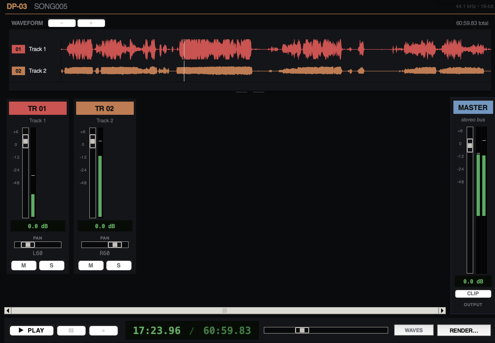
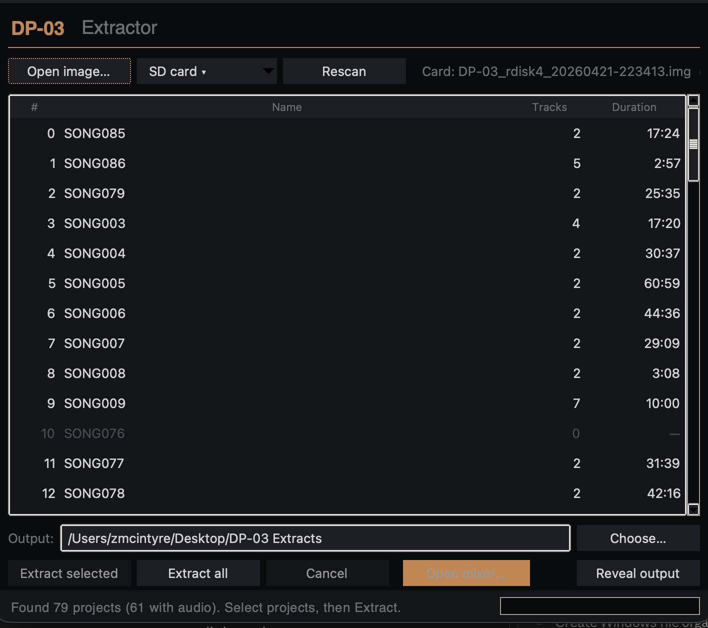

# DP-03 Extractor

Desktop GUI + CLI tools for scanning and extracting tracks from Tascam DP-03 / DP-03SD card images.

This project exists for one reason: DP-03 owners keep ending up with songs trapped on old cards, and Tascam's built-in export workflow is painfully manual. DP-03 Extractor gives you a safer desktop layer to inspect a card image, see which projects are on it, and export each discovered track as a standard WAV.

Status: beta, but already useful for real recovery and archive workflows.

## Screenshots


*Live mixer — scrub the waveform, solo/mute tracks, watch per-channel peaks and master clip.*


*Project browser — every recoverable song on the card, at a glance.*

## What it does

- Scan a DP-03 / DP-03SD full-card image and list projects
- Extract per-track WAVs from the hidden multitrack storage area
- Open the results in a simple desktop GUI
- Detect inserted DP-03 cards on macOS and Windows
- Optionally audition / rough-mix extracted tracks with the built-in mixer

## Supported workflow

Best path today:

1. Make a raw image of the card or let the app image it for you
2. Open the image in DP-03 Extractor
3. Review the discovered projects
4. Extract tracks to a normal folder of WAVs
5. Open those WAVs in any DAW

Important: do recovery work from a card image or a copy whenever possible.

## What it is not

- Not a DAW replacement
- Not an official Tascam utility
- Not a writer/editor for DP-03 cards
- Not a guarantee that every unknown card or firmware variant is fully supported yet

The goal is safe read-first extraction.

## Project structure

- `dp03app/` — desktop GUI app
- `dp03extract/` — extraction backend + CLI
- `packaging/` — PyInstaller spec for Windows builds
- `tests/` — regression tests
- `shared/dp03/notes/` — reverse-engineering notes and format findings
- `landing-page/` — simple marketing/download landing page assets

## Quick start

### macOS

From the project root:

```bash
python3 -m dp03app
```

If your default Python does not have a working Tk build, use:

```bash
./Launch\ DP-03\ Extractor.command
```

> **macOS Python note.** Homebrew's `python@3.14` currently ships without Tk
> (`_tkinter`), so the app won't launch against it. If you see
> `ModuleNotFoundError: No module named '_tkinter'`, install Python **3.12**
> from [python.org](https://www.python.org/downloads/macos/) and run the app
> with that interpreter instead (`python3.12 -m dp03app`). This is an
> upstream Homebrew packaging issue, not the app.

### Windows

Double-click:

```text
Launch DP-03 Extractor.bat
```

Or run from Command Prompt:

```bat
py -3 -m dp03app
```

See `WINDOWS.md` for the full Windows guide.

## CLI usage

The CLI is useful for scripted extraction and validation.

List song slots from a full disk image:

```bash
python3 -m dp03extract list /path/to/card.img
```

Inspect a project using a known catalog from a source checkout:

```bash
python3 -m dp03extract project-info /path/to/card.img \
  --catalog shared/dp03/projects_catalog.csv \
  --project-idx 140
```

Extract one project:

```bash
python3 -m dp03extract extract-project /path/to/card.img \
  --catalog shared/dp03/projects_catalog.csv \
  --project-idx 140 \
  --out-dir ./out/song140
```

Extract all cataloged projects from a source checkout:

```bash
python3 -m dp03extract extract-all-projects /path/to/card.img \
  --catalog shared/dp03/projects_catalog.csv \
  --out-dir ./out/all-projects
```

The wheel / sdist package contains the app and backend code, but not local validation assets like card images, extracted WAVs, or the example catalog CSV in `shared/`. For catalog-based examples, use a source checkout or GitHub source archive.

## Optional mixer dependencies

The core extractor uses the Python standard library.

The optional live mixer / render features use:

- `numpy>=1.24`
- `sounddevice>=0.4.6`

Install them with:

```bash
python3 -m pip install -r requirements.txt
```

## Packaging for release

### Python package metadata

A `pyproject.toml` is included so the app/backend can be packaged cleanly for GitHub release and future pip-style distribution.

Build local source + wheel artifacts with:

```bash
python3 -m pip install --user build
python3 -m build
```

That creates:

```text
dist/
```

### Windows standalone build

```bash
py -3 -m pip install --user pyinstaller
py -3 -m PyInstaller packaging/dp03app.spec
```

That creates:

```text
dist/DP-03 Extractor/
```

Ship the whole folder, not just the `.exe`.

### Suggested GitHub release assets

For the first public release, include:

- Windows build zip of `dist/DP-03 Extractor/`
- Source code zip / tarball from GitHub
- `DP-03 Extractor User Guide.pdf`
- A few screenshots of the GUI
- Short release notes explaining image-first extraction and current limitations

## Verification

Regression test:

```bash
python3 -m unittest discover -s tests -v
```

CLI smoke check:

```bash
python3 -m dp03extract --help
```

## Known limitations

- The GUI app itself does not expose a `--help` flag; launching it starts Tk
- Some workflows still rely on a known project catalog CSV for full CLI extraction
- Validation depends on local card images that are intentionally not shipped in the repository
- Windows raw-disk access still requires Administrator privileges when reading directly from `\\.\PhysicalDriveN`

## Reverse-engineering notes

This repository includes selected technical notes used to decode the DP-03 hidden storage format:

- `shared/dp03/notes/FORMAT_SPEC.md`
- `shared/dp03/notes/AUDIO_LAYOUT.md`

Those documents are useful if you want to understand how the extractor works or help extend support.

## Contributing

Bug reports, card-compatibility notes, and extraction edge cases are especially helpful.

Before opening a PR:

1. Run `python3 -m unittest discover -s tests -v`
2. Run `python3 -m dp03extract --help`
3. If you changed packaging metadata, also run `python3 -m pip install --user build && python3 -m build`
4. Keep raw card images and extracted audio artifacts out of Git

Use the issue templates for bug reports and feature requests. For contributor workflow details, see `CONTRIBUTING.md`.

## Licensing

Copyright © Zachary McIntyre. All rights reserved.

This repository is shared for evaluation, testing, and product development context only. No open-source license is granted for copying, redistribution, modification, resale, or commercial reuse without explicit permission.
